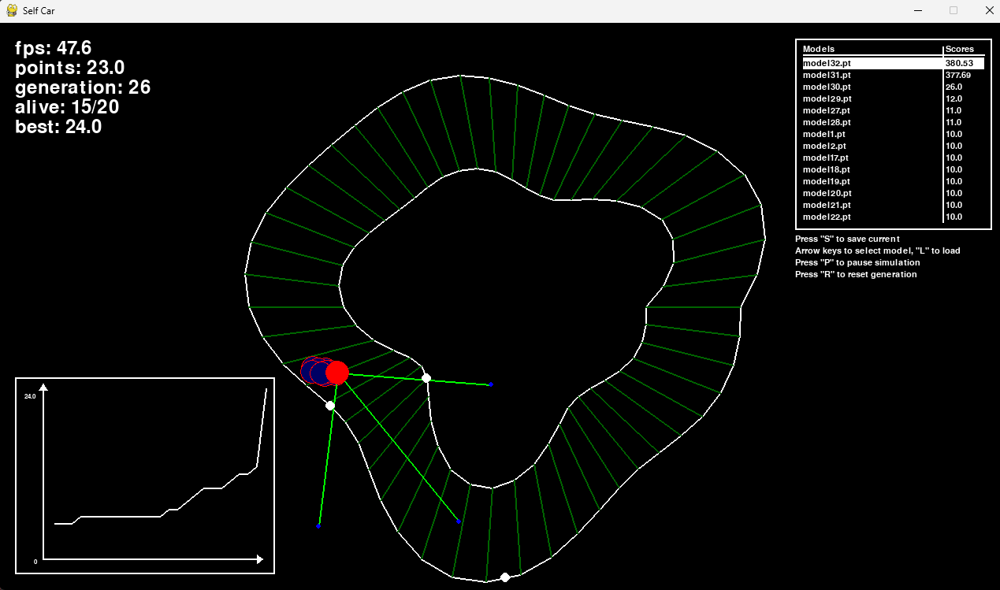
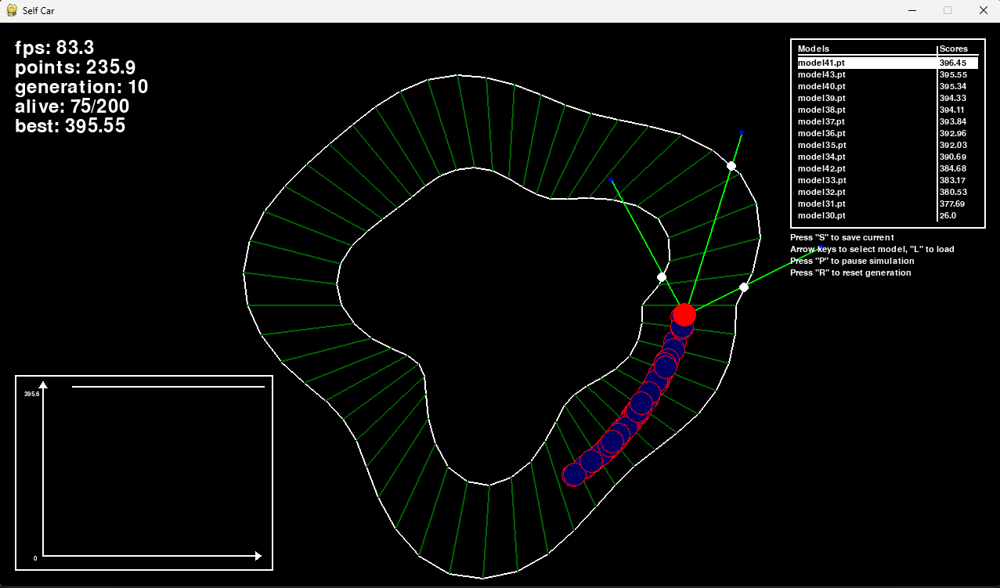
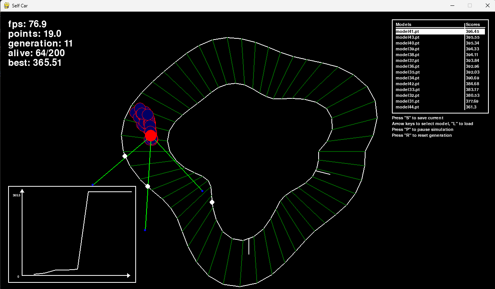

# SelfCar
This is a project where Neural network learns how to traverse optimally in the given track.
But there are some limitations to make task harder:
- car for steering can use only three sensors - front, right and left
- car cannot leave the track - cross white line
- task is to ride as fast and optimally as possible

## How it works?
Each generations there are created N amount of cars and in the end of completing 3 laps or every car crashed into a wall the best one is choosen (car which has most amount of points).
From that best_car is created next generation, making similar models, and choosing the best again. That repeats itself and better and better models are created.

## How best car is choosen?
As I mentioned each generation best car is choosen. And it is choosen based on amount of points (higher ->  better). So how do cars loose and get points:
- +1 point when car croses a checkpoint (dim greenlines all across the track)
- +n point are given when lap is finished (less time it took -> better score, technically its not time but amount of updates that has been made)
- -10 point if crashed (also stops model from continuing race in current generatons)

# How to run this project?
There are two ways to run this project:

## First option (recomended)
This app uses python 3.14. How to run program using venv:
1. `python -m venv .venv` - to create virtual enviroment
2. `python -m pip install -r requirements.txt` - install libraries
3. `python main.py` - run app
Enjoy app.

## Second option
Just run this python app. As simple as it sound for this project is not that simple. The thing is that to run this project you need to have pyTorch installed. And its pretty heavy. You can choose whether you want cuda cores or cpu calculations (in config).
1. You need to have python installed
2. Install all required libraries: pytorch, numpy and pygame (more details in requirements.txt)
3. Run main.py
Enjoy app.

# Personalize
These two variable controll how fast model are trained `N = 50` `MUTATION_STRENGTH = 0.03`.
N - amount of cars per generation. MUTATION_STRENGTH - how randomized models differ from each other.

`ADD_DIF = True` if you would turn on this option two segments on inner circle will stick out so now its harder to ride a car.

# Controlls
`R` - reset generation

`P` - pause simulation

`S` - save current best car model

`ArrowUp` `ArrowDown` - choose model to load

`L` - load selected model

# Tests
I tried a lot of models, I trained them fun for a half an hour and my best result was ~397 point. It would be nice to train them more and see whether 400 score barrier can be broken. I suggest to choose as high as possible N with still good FPS so simulation is fast. MUTATION_STRENGTH is another significant training factor. I suggest to make it in range of 0.01 - 0.1. If you go lower, its really long to get decent results - car are very repetitive. If you would go higher than models would be really different and it also would be hard to train models and see improvements step by step. You would see random improvements if MUTATION_STRENGTH is high. Sweet point is about 0.03, but of course you may find other value perform better.

# Previews
Training:

Advanced models:

Difficult mode:

# AI usage
AI was used ad documentation for pyTorch. Also it was used for debugging.